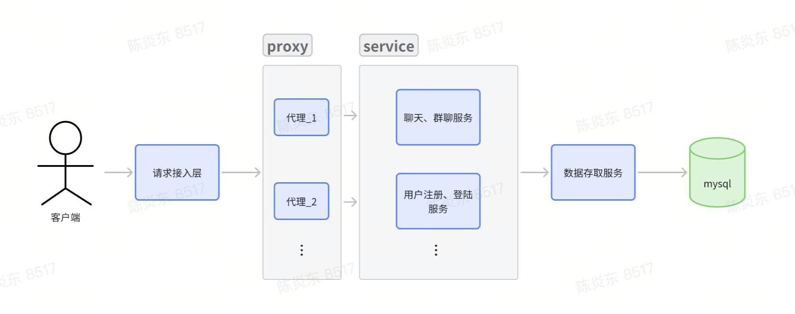

# ChatServer

## 简介

一个简单的分布式聊天服务器

## 软件架构



## 安装教程

### 前置准备
1. 安装protobuf
输入以下命令安装protobuf
```
sudo apt update
sudo apt install protobuf-compiler libprotobuf-dev
```
检查是否安装成功
```
protoc --version
```
2. 安装zookeeper开发库
```
sudo apt update && sudo apt install libzookeeper-mt-dev
```
3. 安装mysql开发库
```
sudo apt update && sudo apt install libmysqlclient-dev
```
4. 安装redis开发库
```
sudo apt update && sudo apt install libhiredis-dev
``` 
5. 安装muduo网络库
```
sudo apt update && sudo apt install libmuduo-net-dev libmuduo-base-dev
```

### 编译rpc框架
1. 通过命令`cd mrpc`切到mrpc目录下
2. 输入`sh configure.sh`一键编译安装。

### 编译聊天服务器
1. 切换到项目根目录
2. 输入`sh configure.sh`一键编译安装。

### 启动服务器
1. 切换到bin目录下
2. 执行./ChatServer port启动请求处理服务器
3. 执行./RepoService 启动存储层服务
4. 输入./ChatClient ip port启动测试客户端

### 新增服务
1. 编写服务接口配置文件xxx.proto
2. 输入命令：
```
protoc --cpp_out=./ --grpc_out=./ --plugin=protoc-gen-grpc=`which grpc_cpp_plugin` xxx.proto
```
3. 注册服务

### 集群部署
待续...

